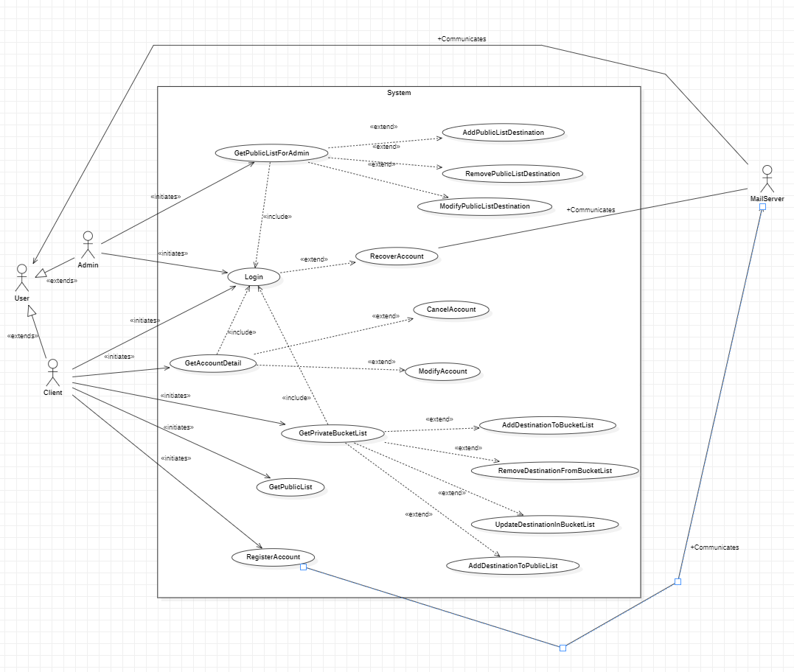
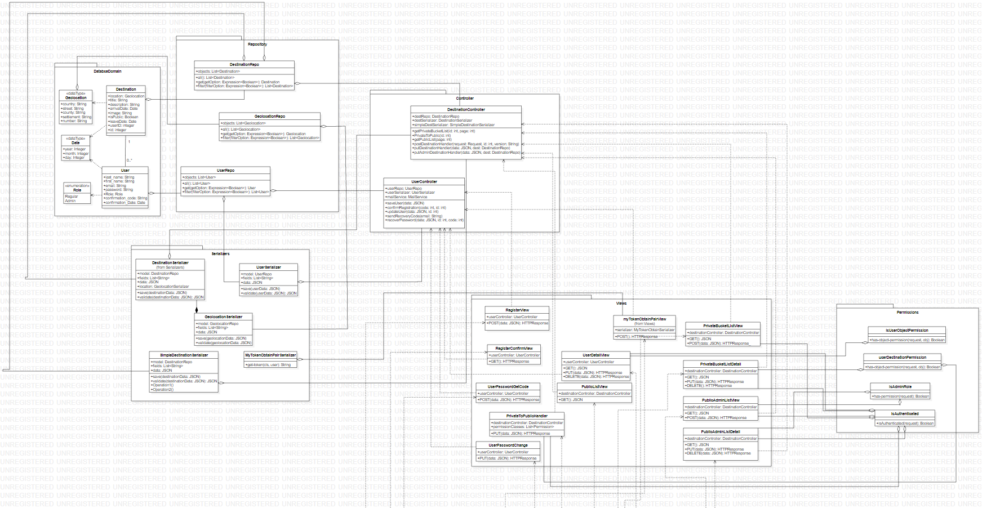

# Project Documentation

For the purpose of this project, two technologies were used, namely React and Django Rest Framework, to implement the following features:

## Backend

### Structure

Backend is build using Django Rest framework with the following structure:

### Usage

1. The backend is deployed on an Aws instance, with free tier, and using the following technologies:
    - Gunicorn, it is used instead of the development server, with 3 workers, with the information in mind, that this is a small application
    - nginx, used as a proxy, for better segregation of the backend
    - certbot, used to acquire a certificate for the proxy server, for https connection

For specific usage, with all the public uris can be found here: [Specification](./BackendDocs.md)